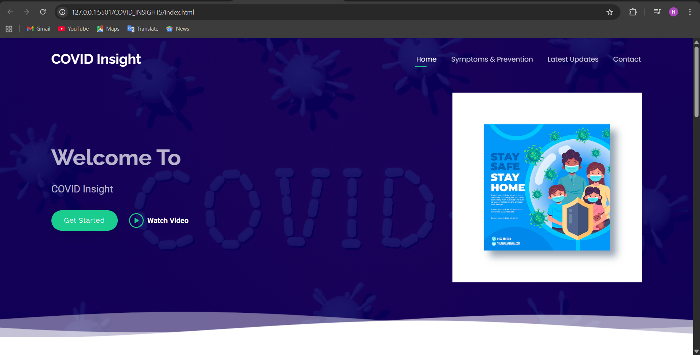
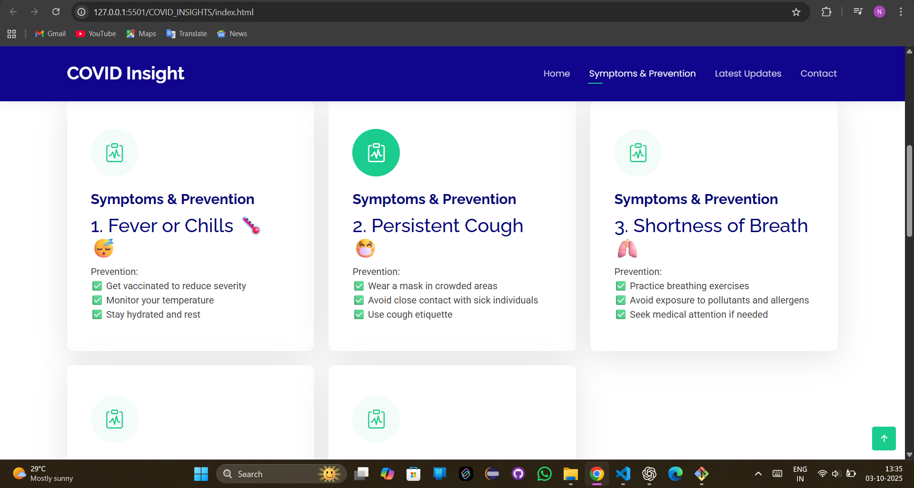
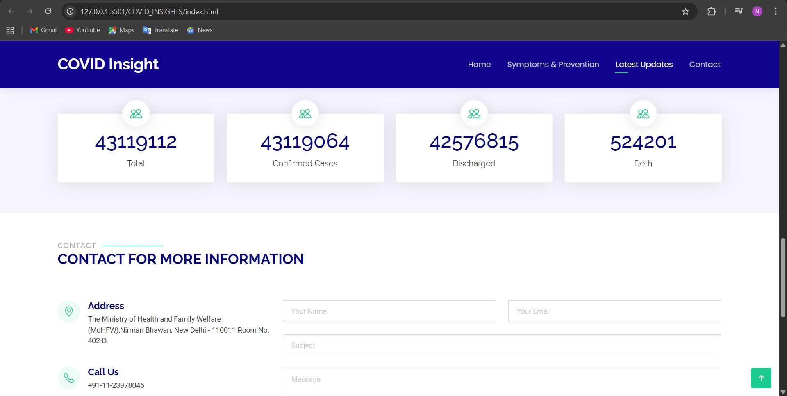
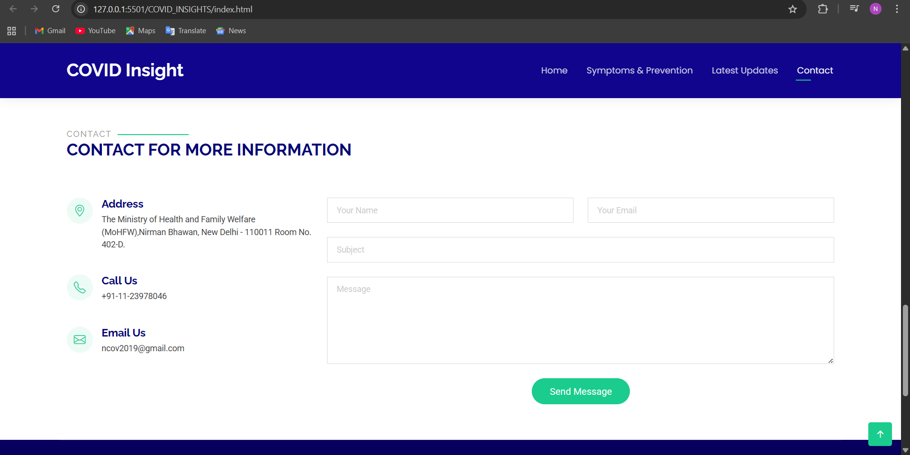
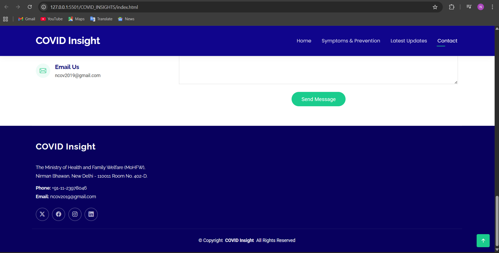

# COVID_INSIGHTS 🦠💻

A **mini responsive website** built with **Bootstrap 5** that displays live **COVID-19 statistics** fetched from a public API. This project is aimed at learning **API integration**, **responsive web design**, and **front-end development**.

---

## 🔹 Features ✨

- 🌐 Live COVID-19 stats fetched using **Axios** from [Rootnet COVID-19 API](https://api.rootnet.in/covid19-in/stats/latest)
- 📱 Fully **responsive** layout using **Bootstrap 5**
- 🧭 Smooth scrolling and **mobile-friendly navigation**
- 🏠 Hero section with images and call-to-action buttons
- 📊 Stats section with **Total, Confirmed, Discharged, and Deaths**
- 💉 About section describing **Symptoms & Prevention**
- 📧 Contact form with **email and validation**
- 🦶 Footer with **contact info and social links**
- 🔝 Scroll-to-top button, preloader, and animations via **AOS & GLightbox**

---

## 🔹 Tech Stack / Libraries Used 🛠️

- **HTML5 / CSS3 / JS**
- **Bootstrap 5**
- **Axios** (for API calls)
- **AOS** (Animate On Scroll)
- **GLightbox** (Video lightbox)
- **Swiper** (Sliders)
- **PureCounter** (Animated counters)

---

## 🔹 Screenshots 🖼️
- **Hero Section**  
  

- **Symptoms & Prevention Section**  
  

- **Latest Updates / Stats Section**  
  

- **Contact Section**  
  

- **Footer Section**  
  

---


## 🔹 Demo 🎬


---


## 🔹 How to Run Locally 💻

1. Clone the repository:
   ```bash
   git clone https://github.com/nikitajadhav05/COVID_INSIGHTS.git


   🙋‍♀️ Author
Nikita Jadhav
📧 [nikitajadhav9322@gmail.com](mailto:nikitajadhav9322@gmail.com)  
🔗 [GitHub: nikitajadhav05](https://github.com/nikitajadhav05)
🔗 [LinkedIn: Nikita Jadhav](https://www.linkedin.com/in/nikita-jadhav-899867316)


⭐ If you found this project helpful, consider giving it a star!
